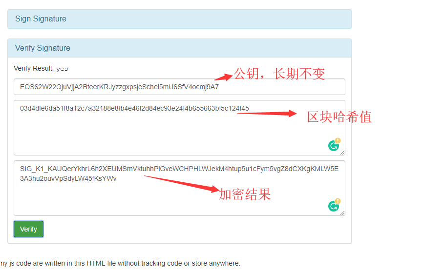
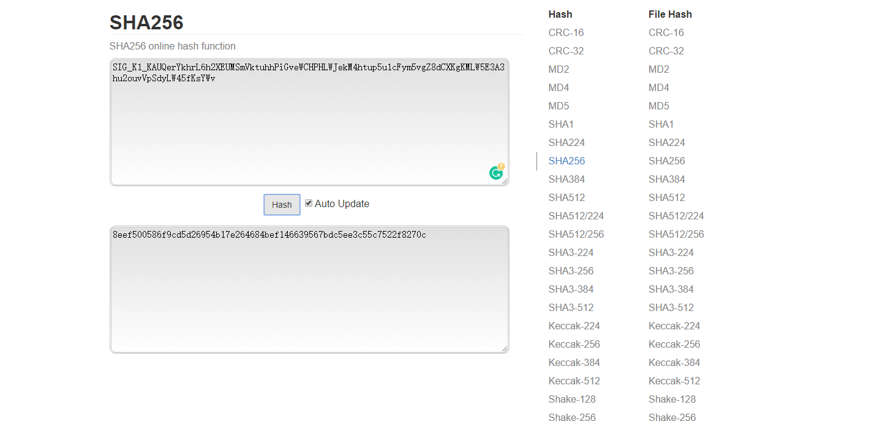

LuckEos 公平性验证
---

## LuckEos 开奖方法

* 根据 EOS 区块 Hash 作为种子，用提前公布的公私钥对签名
* 对签名结果做 SHA256 得到开奖 HASH
* 可用公式表示如下: 开奖 HASH = sha256(sign(BlockHash))
* 彩种取法
*     幸运时时彩类彩种：取开奖 HASH 最后 5 位数字作为开奖结果
*     幸运赛车类彩种  ：取开奖 HASH  从后往前取不重复的1-10，其中10使用十六进制a表示，如果当期开奖hash无法取满1-10十个
      不同的数字，则根据1-10顺序补足10个数字
*     幸运时时彩类彩种：取开奖 HASH 最后 3 位数字作为开奖结果，取值范围1-6
*     幸运飞艇类彩种  ：取开奖 HASH  从后往前取不重复的1-10，其中10使用十六进制a表示，如果当期开奖hash无法取满1-10十个
      不同的数字，则根据1-10顺序补足10个数字
*     幸运二八类彩种 取开奖 HASH 最后 3 位数字作为开奖结果，取值范围0-9

## 为什么能保证开奖结果是公平的

* 玩家无法作弊：前一分钟的投注，根据下一分钟第一个区块 Hash 开奖
* BP无法作弊：BP在出块的时候无法确定 Hash 对应的开奖结果（因为区块 Hash 只是种子）
* 项目方无法作弊：项目方的公钥是提前公布的，并且保持长期不变，只能用此公钥对应的私钥对区块Hash签名，而区块 Hash 是项目方无法控制的

## 如何验证公平性

我们以这次开奖结果为例:

区块 Hash: 
`03d4dfe6da51f8a12c7a32188e8fb4e46f2d84ec93e24f4b655663bf5c124f45`

对区块 Hash 的签名:
`SIG_K1_KAUQerYkhrL6h2XEUMSmVktuhhPiGveWCHPHLWJekM4htup5u1cFym5vgZ8dCXKgKMLW5E3A3hu2ouvVpSdyLW45fKsYWv`

签名公钥（长期不变）:
`EOS62W22QjuVjjA2BteerKRJyzzgxpsjeSchei5mU6SfV4ocmj9A7`

### 验证区块 Hash 的签名是不是正确

可使用第三方工具: [https://bachvtuan.github.io/eos-key-tools/](https://bachvtuan.github.io/eos-key-tools/)

### 根据签名获得开奖 Hash

可使用第三方工具: [https://emn178.github.io/online-tools/sha256.html](https://emn178.github.io/online-tools/sha256.html)

