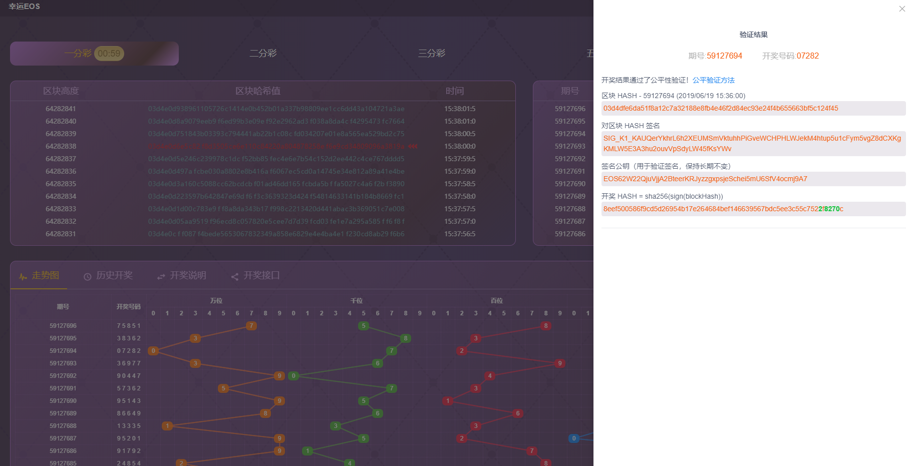
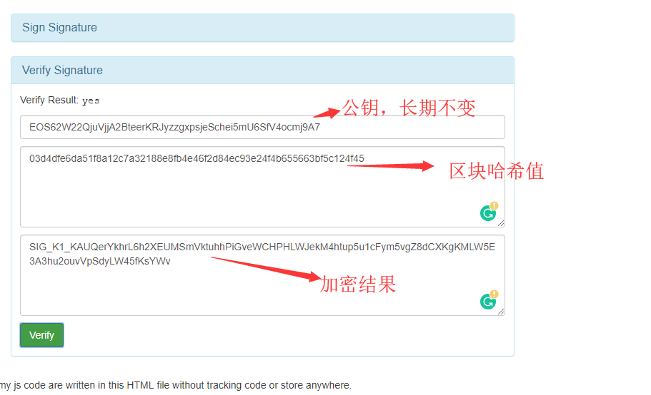
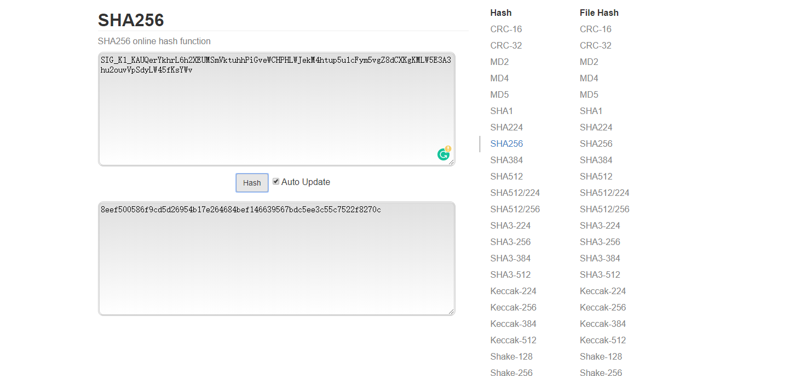

EOSDatasource Fairness Verification
---

## EOSDatasource Reveal Steps

* Use the first EOS Block Hash starting every minute as seed, and sign with an pair of long term unchanged unchanged EOS private and public keys
* Perform sha256 hash on the signature result to get the reveal Hash
* Calc Formula: Reveal HASH = sha256(sign(BlockHash))
* How to choose Lottery Result
* EOSSSC Lottery: Use the last 5 digits of the reveal Hash as lotto result
* EOSPK10 Lottery: Use the last non-repeating 10 digits of the reveal Hash as lotto result,if the reveal hash insufficient,then fill     with one to ten by order
* EOSairship Lottery: Use the non-repeating 10 digits of the reveal Hash as lotto result,if the reveal hash insufficient,then       fill with one to ten by order
* EOSK3 Lottery: Use the last 3 digits of the reveal Hash as lotto result , the ranges of number is one to six
* EOS28 Lottery: Use the last 3 digits of the reveal Hash as lotto result , the ranges of number is zero to ten

## Why Reveal Result Absolute Fairness

* Player CANNOT cheat: Players bet in previous minute, and BlockHash seed is the first block in coming minute.
* EOS BP CANNOT cheat: BP can predict block hash, but cannot predict signature hash, since block hash is NOT the final result, but only a seed.
* LuckEos team CANNOT cheat: Signature EOS public key is long term unchanged and pre-known by everybody, and the public key matches the one and the only private key. The most important point is LuckEos team cannot predict block hash which is controlled by BP nodes.

## Fairness Verification How-to

Take the reveal result as an example:

Block Hash: 
`03d4dfe6da51f8a12c7a32188e8fb4e46f2d84ec93e24f4b655663bf5c124f45`

Signature of Block Hash:
`SIG_K1_KAUQerYkhrL6h2XEUMSmVktuhhPiGveWCHPHLWJekM4htup5u1cFym5vgZ8dCXKgKMLW5E3A3hu2ouvVpSdyLW45fKsYWv`

Signature Public Key (Long term unchanged):
`EOS62W22QjuVjjA2BteerKRJyzzgxpsjeSchei5mU6SfV4ocmj9A7`

### Signature of Block Hash Verification

Open a 3rd party EOS key tool: [https://bachvtuan.github.io/eos-key-tools/](https://bachvtuan.github.io/eos-key-tools/)

### Reveal Hash Verification

Open a 3rd party sha 256 hash tool: [https://emn178.github.io/online-tools/sha256.html](https://emn178.github.io/online-tools/sha256.html)

